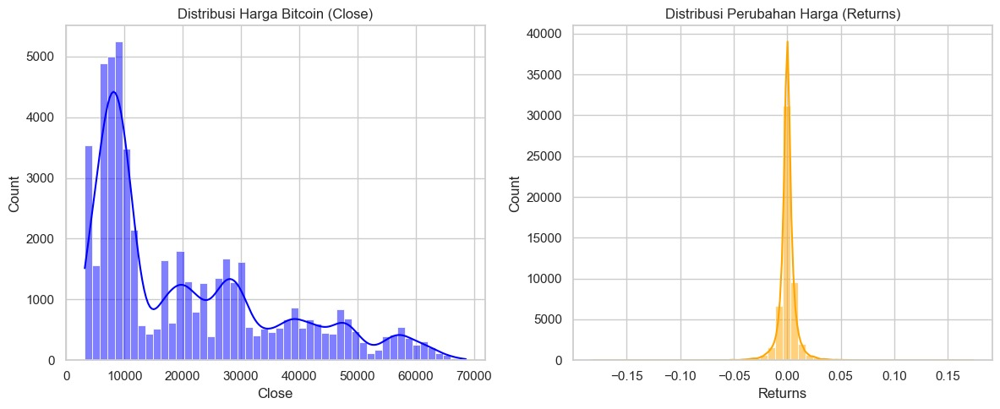

# 📈 Deep Seq2Seq Crypto Forecasting


> **A comparative study of deep learning architectures for high-volatility financial time-series forecasting.**

## 📌 Project Overview
**Deep Seq2Seq Crypto Forecasting** is an advanced Deep Learning project designed to predict Bitcoin (BTC-USD) price movements. Unlike standard regression models, this project tackles the complexity of financial markets by treating the problem as a **Multivariate Time-Series** task.

The core of this project is the implementation of a **Seq2Seq (Sequence-to-Sequence) LSTM Encoder-Decoder** architecture, allowing the model to learn complex temporal dependencies from multiple input features (Open, High, Low, Close, Volume) to generate accurate multi-step forecasts.

## 🚀 Key Features
* **Multivariate Analysis**: Ingests multiple data points (OHLCV) simultaneously to capture market sentiment and volatility better than univariate models.
* **Seq2Seq Architecture**: Implements an Encoder-Decoder structure where:
    * **Encoder**: Compresses the input time series into a fixed-length context vector.
    * **Decoder**: Unfolds the context vector to predict future steps.
* **Data Pipeline**: Robust preprocessing using `MinMaxScaler` and sliding window techniques to normalize highly volatile crypto data.
* **Model Comparison**: Benchmarks a standard LSTM baseline against the advanced Seq2Seq model to demonstrate architectural superiority.

## 📊 Technical Architecture

### 1. The Challenge
Financial time series data is non-stationary, noisy, and chaotic. Standard linear models often fail to capture the non-linear relationships in crypto markets.

### 2. The Solution: LSTM Encoder-Decoder
This project leverages Long Short-Term Memory (LSTM) networks to handle the "vanishing gradient" problem in long sequences.

* **Input Layer**: Accepts a window of historical data (e.g., past 60 hours).
* **Hidden Layers**: Stacked LSTM units with Dropout for regularization.
* **Output**: Predicted closing price for the next time step.

<div align="center">
  
  <p><em>Figure 1: Model performance visualizing Predicted Prices (Orange) vs Actual Market Prices (Blue).</em></p>
</div>

## 📈 Performance Metrics
The models were evaluated using **Mean Absolute Error (MAE)** to measure the average magnitude of errors in a set of predictions, without considering their direction.

| Model Architecture | MAE Score (Validation) |
| :--- | :--- |
| **Baseline LSTM** | **0.0100** |
| **Seq2Seq LSTM** | **0.0287** |

### Key Insight: Why did the simpler model win?
Interestingly, the **Baseline LSTM outperformed the complex Seq2Seq architecture** (0.0100 vs 0.0287). This finding highlights a critical principle in quantitative modeling:

> *"Complexity does not always equal accuracy. For short-term volatility in this specific dataset, the simpler LSTM architecture generalized better, whereas the Seq2Seq model—despite its theoretical power—likely suffered from overfitting due to the noise inherent in cryptocurrency markets."*

## 🛠️ Tech Stack
* **Core**: Python 3.x
* **Deep Learning**: TensorFlow / Keras
* **Data Processing**: Pandas, NumPy, Scikit-Learn
* **Visualization**: Matplotlib, Seaborn

## 💻 Usage
1.  **Clone the Repository**
    ```bash
    git clone [https://github.com/adolesans/Cryptocurrency-Multivariate-Time-Series-Forecasting.git](https://github.com/adolesans/Cryptocurrency-Multivariate-Time-Series-Forecasting.git)
    ```
2.  **Install Dependencies**
    ```bash
    pip install -r requirements.txt
    ```
3.  **Run the Notebook**
    Open `Model_Training_Seq2Seq.ipynb` in Jupyter or Google Colab to retrain the models or view the analysis.

## 📜 License
Distributed under the MIT License.

---
*Developed by [Annisa D.Y.](https://www.linkedin.com/in/annisa-dewiyanti/)*
